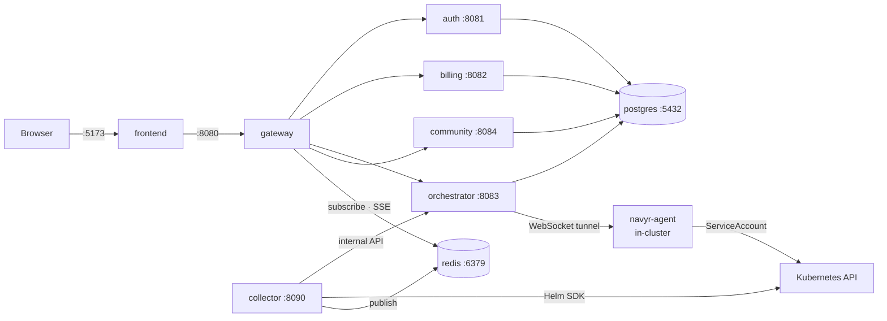

# navyr-install

> Install Navyr with Docker Compose. Everything you need, nothing you don't.

**Last updated: 2026-09-17**

## Overview

Navyr is a Kubernetes runtime-operations platform. This repository is the
**installer**: the Compose file, the environment template and the instructions
to get from nothing to a working workspace.

All images are pulled from the GitHub Container Registry (`ghcr.io/navyr-io/*`)
and are **public** — no account, no login, no access to any private repository
is required.

| Component | Image | Port |
|---|---|---|
| gateway | `ghcr.io/navyr-io/navyr-gateway` | `8080` |
| auth | `ghcr.io/navyr-io/navyr-auth` | `8081` |
| billing | `ghcr.io/navyr-io/navyr-billing` | `8082` |
| orchestrator | `ghcr.io/navyr-io/navyr-orchestrator` | `8083` |
| community | `ghcr.io/navyr-io/navyr-community` | `8084` |
| collector | `ghcr.io/navyr-io/navyr-collector` | `8090` |
| frontend | `ghcr.io/navyr-io/navyr-frontend` | `5173` |
| db | `postgres:15-alpine` | `5432` |
| redis | `redis:7-alpine` | `6379` |

## Architecture



> Clusters connect to the orchestrator via the **navyr-agent** — an in-cluster agent that maintains an outbound WebSocket tunnel. No inbound firewall rules or kubeconfig sharing required.

## Quick start

### 1. Nothing to authenticate

The service images are public. `docker compose` pulls them anonymously:

```bash
docker pull ghcr.io/navyr-io/navyr-gateway:latest   # works with no credentials
```

If this command works, the rest will too.

### 2. Configure environment

```bash
cp .env.example .env
```

Fill in the required secrets. Generate each with:

```bash
openssl rand -hex 32
```

Required variables:

| Variable | Purpose |
|---|---|
| `NAVYR_POSTGRES_PASSWORD` | PostgreSQL password |
| `NAVYR_JWT_SECRET` | JWT signing key (shared by gateway, auth, orchestrator) |
| `NAVYR_INTERNAL_SECRET` | Internal service header signing key |
| `NAVYR_CREDENTIAL_KEY` | AES-256 key for cluster credential encryption |
| `NAVYR_WS_TICKET_SECRET` | WebSocket exec ticket signing key |
| `COMMUNITY_SECRETS_KEY` | Community service signing key |

### 3. Run

```bash
docker compose up -d
```

Access the workspace at **http://localhost:5173**. Register your organization on first access.

### 4. Connect a cluster

After logging in, go to **Clusters → Add Cluster** and follow the agent installation instructions. The agent establishes an outbound WebSocket tunnel to the orchestrator — your cluster's Kubernetes API is never exposed publicly.

Install the agent into the target cluster:

```bash
helm install navyr-agent oci://ghcr.io/navyr-io/charts/navyr-agent --version 0.1.0 \
  --set image.tag=0.1.0 \
  --set agent.orchestratorUrl=ws://YOUR_HOST:8083 \
  --set agent.token=<TOKEN_FROM_UI> \
  --set agent.orgId=<ORG_ID> \
  --set agent.clusterId=<CLUSTER_ID>
```

`orchestratorUrl` is the address **your cluster** uses to reach the orchestrator —
not the one you type in the browser. It is almost never `localhost`: the agent runs
inside the cluster, where `localhost` is the pod itself. See `NAVYR_PUBLIC_WS_URL`
in `.env.example` for how to find the right value on each topology.

---

## Pinning a version

Replace `latest` with a specific image tag for reproducible deployments:

```bash
NAVYR_VERSION=7f21918 docker compose up -d
```

Available tags:

| Tag | Meaning |
|---|---|
| `latest` | the most recent published build |
| `<short-sha>` | a specific commit, e.g. `7f21918` — **the tag to pin** |
| `sha-<short-sha>`, `main` | produced by an older CI pipeline; frozen since 2026-08-19 |

To list what actually exists, use the package page for each image on GHCR
(`github.com/orgs/navyr-io/packages`) — do not rely on guessing a SHA.

## Redis

Redis runs by default — it is no longer behind an optional profile. Two
features depend on it:

- **Event stream (SSE).** `navyr-collector` publishes cluster events to Redis
  Pub/Sub and the gateway serves them to the browser on
  `GET /api/v1/events/stream`. Without Redis that endpoint returns `503`.
- **Distributed rate limiting.** Optional; without Redis the gateway falls back
  to an in-memory limiter, which is per-instance and therefore incorrect when
  running more than one gateway replica.

To enable rate limiting, set in `.env`:

```
RATE_LIMIT_ENABLED=true
```

`REDIS_URL` already defaults to `redis://redis:6379` inside the compose network
and only needs to be set when pointing at an external Redis.

## Collector interval

`navyr-collector` scrapes connected clusters on a fixed interval (default
`30s`). Tune it in `.env`:

```
COLLECTOR_INTERVAL=30s
```

## Updating

```bash
docker compose pull
docker compose up -d
```

Migrations run automatically on service startup.

## Stopping

```bash
docker compose down          # stop, keep volumes
docker compose down -v       # stop + delete database
```

## Product specification

See [navyr-docs](https://github.com/navyr-io/navyr-docs) for the product
documentation.

## Production deployment

Compose is the right shape for evaluation, a laptop, or a single on-premise VM.
For a Kubernetes install, use the published chart:

```bash
helm install navyr oci://ghcr.io/navyr-io/charts/navyr --version 0.1.0 \
  --namespace navyr --create-namespace \
  --set secrets.clusterCredentialEncryptionKey=$(openssl rand -hex 32) \
  --set secrets.jwtSecret=$(openssl rand -hex 32)
```

The chart **refuses to install with the example secrets** and tells you which one
is still a placeholder. For a throwaway local install you can accept the
defaults deliberately with `--set secrets.allowInsecureDefaults=true`.

## What this repository is, and is not

It is the distribution artifact, and it is **generated against a contract**, not
written by hand.

`contrato/plataforma.yaml` describes the platform once: which services exist,
which environment variables each one reads, what depends on what, and which
services hold state. The Compose file here is verified against it in CI, so the
installer cannot silently drift from what the services actually need.

That check exists because the same drift already happened: a previous packaging
was missing 15 variables the code reads, and one of them stopped the auth
service from starting in production mode.

## Support

Documentation lives in [navyr-docs](https://github.com/navyr-io/navyr-docs).
